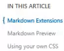

# Scrollspy-Pattern ohne Scroll-Event

Das sogenannte Scrollspy-Pattern wird häufig in Blogs verwendet,
um dem Nutzer einen Fortschritt des gelesenen Inhalts zu präsentieren
oder die aktuelle Teilüberschrift hervorzuheben wenn diese den oberen Rand des Bildschirms erreicht hat.
Aussehen kann das ganze dann in etwa so:<br>
<br>
Frameworks wie Bootstrap oder Plug-ins setzen dieses Pattern schon länger mit Hilfe von Scroll-Events um.
Bisher gab es keine einfache Möglichkeit zu sagen "Dieses Element ist jetzt für den Nutzer sichtbar"
oder "Dieses Element ist nun ganz oben". Gelöst wurde dieses Problem dadurch, dass für jeden Pixel den der Nutzer bereits gescrollt hat, überprüft wird, ob die Top-Position der Elemente den gewünschten Wert erreicht haben oder nicht.
Das diese Art nicht unbedingt effizient ist sollte klar sein, aber wie löst man das ganze besser?
Unser Retter kommt in Form der [Intersection Observer API](https://developer.mozilla.org/en-US/docs/Web/API/Intersection_Observer_API), einer zurzeit noch experimentellen API und der CSS-Position 'sticky'. Jedes mal wenn eine unserer Teilüberschriften 'sticky' ist, also am oberen Rand klebt, möchten wir diese optisch Hevorheben - durch einen Schatten zum Beispiel und zusätzlich soll diese Überschrift in unserem Seiten-Menü markiert werden. // Das sieht so aus //.

## Vorbereitungen und Dummy-Content
Um den "Blog" mit etwas Leben zu füllen und Dinge zu vereinfachen, wird dessen Inhalt dynamisch anhand einer Liste von Bezeichnern gefüllt
```
const SECTIONS = [
    'City Lights',
    'Money Carp',
    'tff 2017',
    'Lily in a Box',
    'Library Lights',
];

shuffle(SECTIONS);

const ARTICLE_SECTION = document.querySelector('#article-section');
const SECTION_LIST = document.querySelector('#section-list');
let arcticleSectionTemplate = '';
let sectionListTemplate = '';

SECTIONS.forEach(section => {
    arcticleSectionTemplate += createSections(section);
    sectionListTemplate += createSectionList(section);
});

ARTICLE_SECTION.insertAdjacentHTML('beforeend', arcticleSectionTemplate);
SECTION_LIST.insertAdjacentHTML('beforeend', sectionListTemplate);
```
Daraus ergeben sich:
- Teilüberschriften
- Bildpfade
- IDs und Links zu diesen

Einheitliche IDs zu haben ist deswegen wichtig, da wir später die aktuelle Überschrift im Seitenmenü markieren wollen und die IDs irgendwie referenzieren müssen.

## Klebt's?

Wann ist ein Element sticky? Leider gibt es kein Event welches ausgelöst wird, wenn ein Element diesen Zustand erreicht hat.
Kein Problem, wir schreiben uns einfach unser eigenes Event und binden dieses als Event an das document. Elemente dieser sind auch nicht mehr Teil des Layouts, Berechnungen mit top und ähnlichem fallen also auch flach.

```
/**
 * Dispatches a `sticky-event` custom event on the element.
 * @param {boolean} sticky True if element is sticky
 * @param {HTML} target Target element.
 */
function fireEvent(sticky, target) {
    const evt = new CustomEvent('sticky-change', {
        detail: {
            sticky,
            target
        }}
    );

    document.dispatchEvent(evt);
}
```
Stattdessen nutzen wir für den Nutzer nicht sichtbare Container die jeweils vor und nach diesem hängen.
Damit fangen wir vier Zustände ab während der Nutzer scrollt:
1. ↓ Überschrift wird sticky wenn dessen oberer Container die obere Kante des Blog-Beitrags erreicht
2. ↓ Überschrift ist nicht mehr sticky wenn es die untere Kante des Blogs erreicht hat
3. ↑ Überschrift ist nicht mehr sticky wenn der obere Container wieder von oben herab in die View gescrollt wird.
4. ↑ Überschrift wird sticky wenn dessen unterer Container von oben herab in die View kommt

Um diese Container zu überwachen, benötigen wir den Intersection-Observer

## Intersection-Observer
